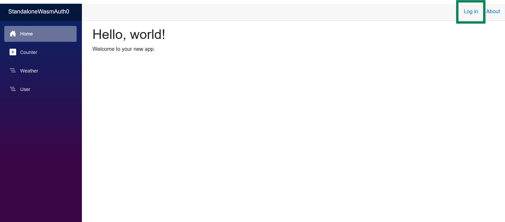

# BlazorWasmStandaloneAuthZeroDemo

## Blazor WASM Standalone demo application to implement authorization using Auth0 and ApiGatewy communicating with WebAPIs

## Main technologies and packages
* .NET 9 and C# 13
* Blazor WASM Standalone and WebAPI
* Yarp.ReverseProxy for ApiGateway
* Auth0 https://auth0.com/ for authorization

## Launching
* Ensure you have .NET 9 installed
* Create Auth0 https://auth0.com/ account
* Create 2 applications in Auth0: single page application and web api
* Open downloaded project (Visual Studio is recommended)
* Fill in `appsettings` with your applications' data from Auth0
* Run all projects except Shared library 

## Presentation
* When you launch the application you can sign in or sign up by clicking the `Log in` button.

* You will be redirected to `Auth0` authorization page. You can sign in our sign up if you don't have account.

* After you authorize, you can visit `Weather` and `User` pages which need authorization. You can see your `e-mail` showing that you are correctly authorized and you can sign out using `Log out` button.

* `Weather` page shows weather conditions selected from `WeatherApi` WebAPI.

* `User` page shows list of users selected from `UserApi` WebAPI. You can add new user by filling the form and clicking `Add User` button.

* If you try to navigate to `Weather` and `User` pages without signing in, you will be informed that authorization is needed. You can then sign in by clicking `Log in` button.

